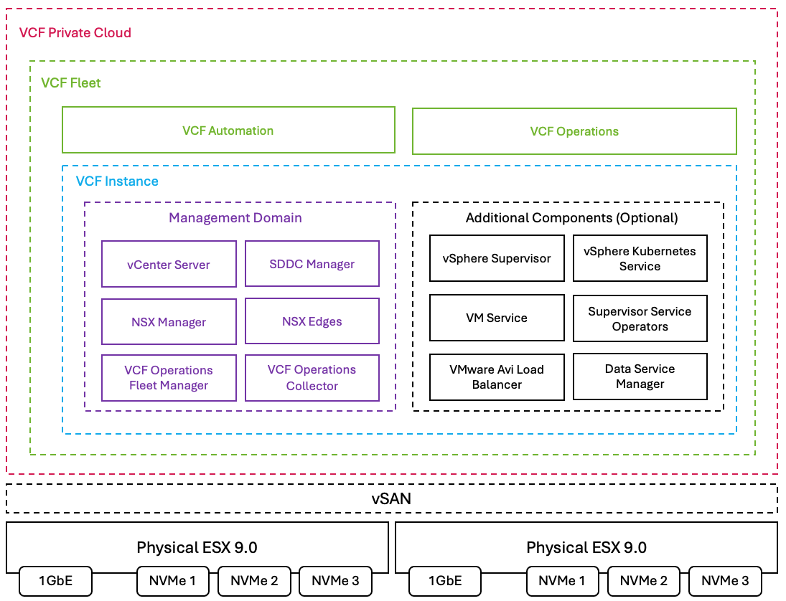
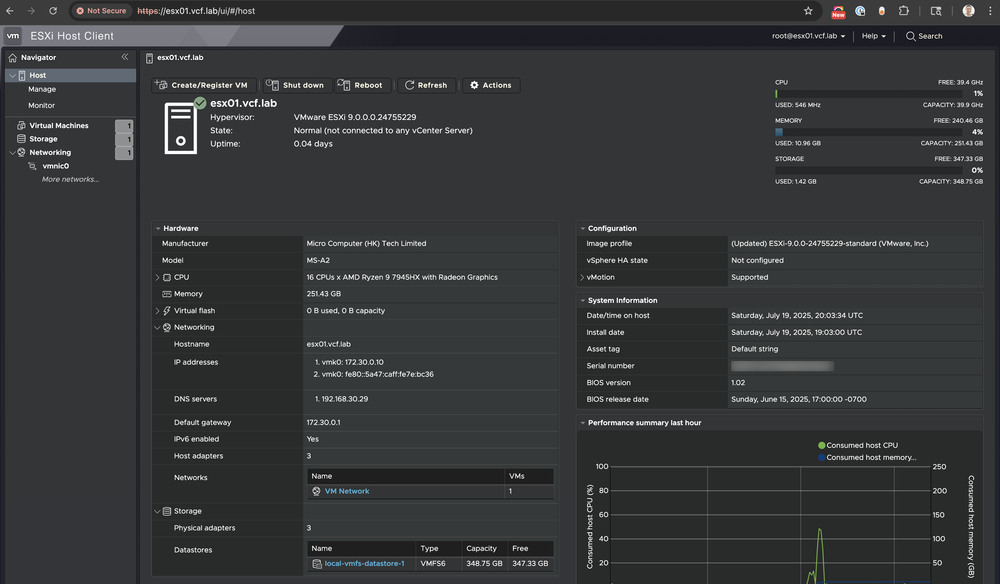
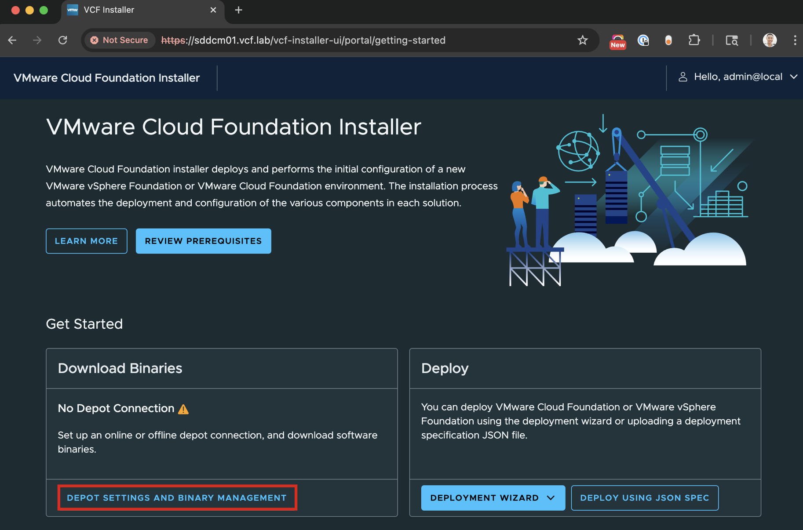
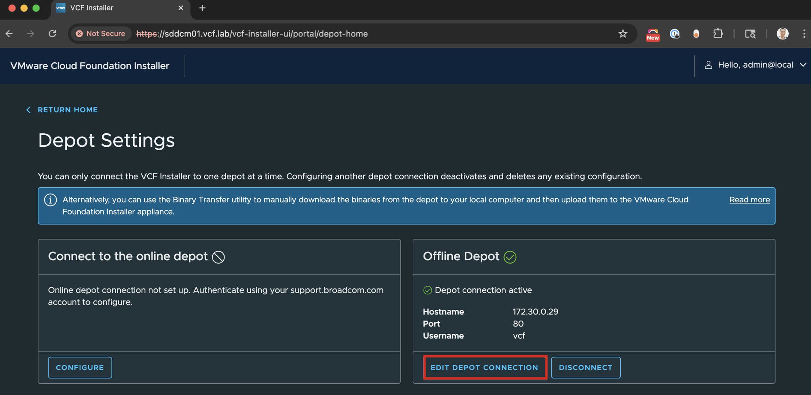
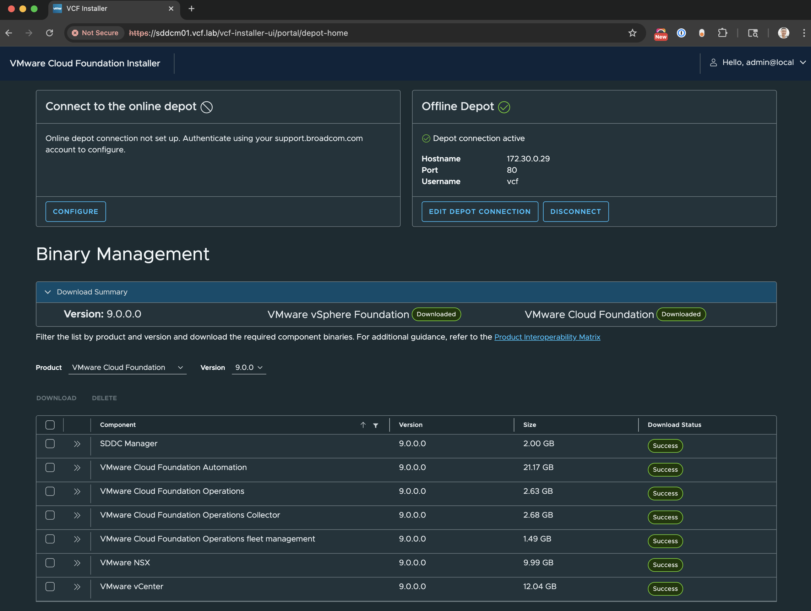
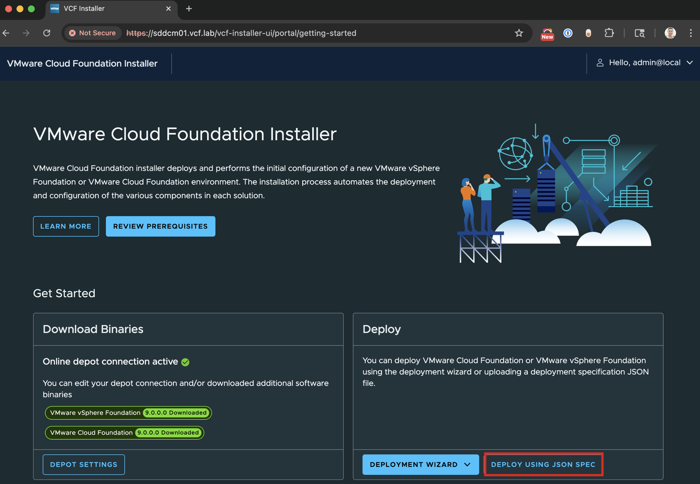
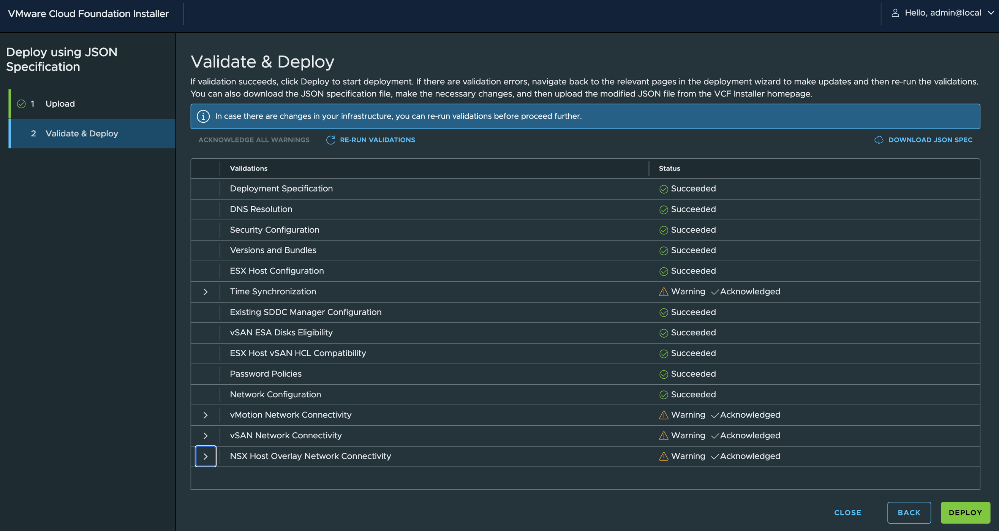
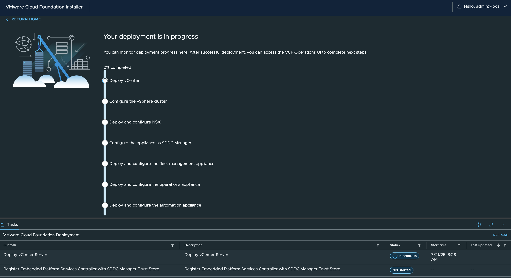
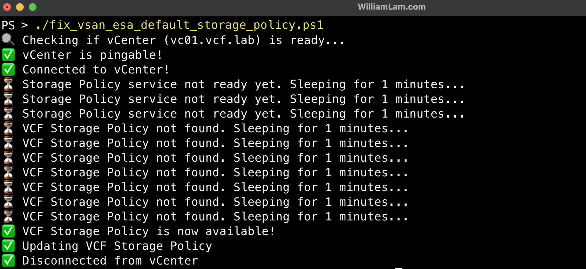
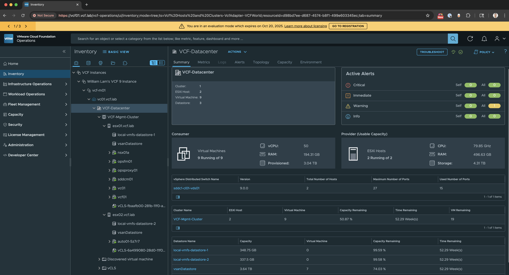

# VMware Cloud Foundation (VCF) 9.x in a Box

Deploy a fully functional VMware Cloud Foundation (VCF) 9.x environment on a single or dual physical ESXi host, optimized for development and lab use. This setup enables users to explore and learn VCF with minimal compute and storage resources.

📒 This deployment does not use Nested ESXi and instead runs directly on physical hosts, in contrast to the [VCF Holodeck 9.0](https://vmware.github.io/Holodeck/) solution.



## Table of Contents

* [Changelog](#changelog)
* [Build of Materials (BOM)](#build-of-materials-bom)
* [Pre-Requisite](#prereq)
* [Installation](#installation)
* [Post Installation](#post-installation)
* [Blog References](#blog-references)

## Changelog

* **08/29/2025**
  * Added post-install documentation section

* **07/28/2025**
  * Initial Release


## Build of Materials (BOM)

 * [VMware Cloud Foundation (VCF) 9.0.0.0](https://support.broadcom.com/group/ecx/productfiles?subFamily=VMware%20Cloud%20Foundation&displayGroup=VMware%20Cloud%20Foundation%209&release=9.0.0.0&os=&servicePk=&language=EN)
 * [2 x Minisforum MS-A2 (7945HX) Barebones](https://amzn.to/4kEnAP5)
    * [1 x Crucial 128GB Kit (2x64GB) DDR5 SODIMM](https://amzn.to/4bcpXFJ)
    * [2 x Dual 64GB DDR5 SODIMM (128GB)](https://amzn.to/4bcpXFJ)
    * 1 x USB Device (16GB or larger) for booting ESXi Installation
    * [2 x SK Hynix Gold P31 500GB NVME](https://amzn.to/4eKEQkm) for ESXi Installation, ESX-OSData & Local VMFS datastore
    * [2 x Sabrent Rocket 1TB NVMe](https://amzn.to/4ltaTYM) for NVMe Tiering
    * [2 x Samsung 990 EVO 2TB NVMe](https://amzn.to/4lQC403) for vSAN ESA
    * [1 x MikroTik CRS304-4XG-IN](https://amzn.to/44J1rt4) for Network Routing
    * [1 x Sodola 4 x 2.5GbE & 2 x 10GbE](https://amzn.to/4lQjZOw) for Network Switching

📒 The above BOM is just [one working example](https://williamlam.com/2025/07/vcf-9-0-hardware-bom-for-silicon-valley-vmug.html), you can certainly swap out components that you might already have or prefer alternatives, just know that you will be responsible for adjusting any configuration that may differ from referenced BOM.

## Prereq

* Minimum 5 VLANs (e.g. 30, 40, 50, 60) for VCF Fleet Deployment
    * VLAN 30 - Management
    * VLAN 40 - vMotion
    * VLAN 50 - vSAN
    * VLAN 60 - ESX/NSX Edge TEP
    * VLAN 70 - Tier 0 Uplink (Optional)

* Here are the following IP Addresses/DNS entries that you will need for initial setup (NSX Edge, Supervisor/VKS are optional)

| Hostname   | FQDN                | IP Address  | Function                                 |
|------------|---------------------|-------------|------------------------------------------|
| dns        | dns.vcf.lab         | 172.30.0.2  | DNS Server                               |
| esx01      | esx01.vcf.lab       | 172.30.0.110| Physical ESX-1 Server                    |
| esx02      | esx02.vcf.lab       | 172.30.0.120| Physical ESX-2 Server                    |
| sddcm01    | sddcm01.vcf.lab     | 172.30.0.12 | VCF Installer / SDDC Manager             |
| vc01       | vc01.vcf.lab        | 172.30.0.13 | vCenter Server for Management Domain     |
| vcf01      | vcf01.vcf.lab       | 172.30.0.14 | VCF Operations                           |
| nsx01      | nsx01.vcf.lab       | 172.30.0.15 | NSX Manager VIP for Management Domain    |
| nsx01a     | mgmt-nsx01a.vcf.lab | 172.30.0.16 | NSX Manager for Management Domain        |
| edge01a    | edge01a.vcf.lab     | 172.30.0.17 | NSX Edge 1a for Management Domain        |
| edge01b    | edge01b.vcf.lab     | 172.30.0.18 | NSX Edge 1b for Management Domain        |
| opsfm01    | opsfm01.vcf.lab     | 172.30.0.19 | VCF Operations Fleet Manager             |
| opsproxy01 | opsproxy01.vcf.lab  | 172.30.0.20 | VCF Operations Proxy Collector           |
| auto01     | auto01.vcf.lab      | 173.30.0.30 | VCF Automation                           |

## Installation

0. Update to the latest Firmware on the MS-A2 (if applicable) by following [these instructions](https://williamlam.com/2025/07/quick-tip-updating-firmware-on-minisforum-ms-a2.html).

1. Setup a VCF Offline Depot using the new `VCF Download Tool` by following the [Broadcom doumentation](https://techdocs.broadcom.com/us/en/vmware-cis/vcf/vcf-9-0-and-later/9-0/deployment/deploying-a-new-vmware-cloud-foundation-or-vmware-vsphere-foundation-private-cloud-/preparing-your-environment/downloading-binaries-to-the-vcf-installer-appliance/download-install-binaries-to-an-offline-depot.html)

After downloading the required metadata/binaries, you should have a directory structure like the following:
```
 PROD
    ├── COMP
    │   ├── ESX_HOST
    │   │   └── VMware-VMvisor-Installer-9.0.0.0.24755229.x86_64.iso
    │   ├── NSX_T_MANAGER
    │   │   ├── VMware-NSX-T-9.0.0.0.24733065.vlcp
    │   │   └── nsx-unified-appliance-9.0.0.0.24733065.ova
    │   ├── SDDC_MANAGER_VCF
    │   │   ├── Compatibility
    │   │   │   └── VmwareCompatibilityData.json
    │   │   └── VCF-SDDC-Manager-Appliance-9.0.0.0.24703748.ova
    │   ├── VCENTER
    │   │   └── VMware-VCSA-all-9.0.0.0.24755230.iso
    │   ├── VCF_OPS_CLOUD_PROXY
    │   │   └── Operations-Cloud-Proxy-9.0.0.0.24695833.ova
    │   ├── VRA
    │   │   └── vmsp-vcfa-combined-9.0.0.0.24701403.tar
    │   ├── VROPS
    │   │   └── Operations-Appliance-9.0.0.0.24695812.ova
    │   └── VRSLCM
    │       └── VCF-OPS-Lifecycle-Manager-Appliance-9.0.0.0.24695816.ova
    ├── metadata
    │   ├── manifest
    │   │   └── v1
    │   │       └── vcfManifest.json
    │   └── productVersionCatalog
    │       └── v1
    │           ├── productVersionCatalog.json
    │           └── productVersionCatalog.sig
    └── vsan
        └── hcl
            ├── all.json
            └── lastupdatedtime.json

19 directories, 15 files
```

You can host the VCF Offline Depot using a traditional HTTP Web Server (HTTPS is NOT required as the automation in 9 will disable HTTPS). Alternatively, you can simply use Python to serve up the directory (see this [blog post](https://williamlam.com/2025/06/using-http-with-vcf-9-0-installer-for-offline-depot.html)) or even a Synology (see this [blog post](https://williamlam.com/2025/06/vcf-9-0-offline-depot-using-synology.html)).

2. Create a bootable ESXi installer with the ESXi ISO (VMware-VMvisor-Installer-9.0.0.0.24755229.x86_64.iso) using [UNetbootin](https://unetbootin.github.io/)

3. We will be performing a scripted installation of ESXi (aka ESXi Kickstart) to remove the number of manual steps that would be needed during the post-installation of ESXi.

4. Edit the [ks-esx01.cfg](config/ks-esx01.cfg)/[ks-esx02.cfg](config/ks-esx02.cfg) and replace the following values with your own desired configurations

💡 To simplify the deployment of multiple ESXi hosts using a single USB drive, you can [create custom UEFI boot menu for ESXi](https://williamlam.com/2025/07/custom-uefi-boot-menu-for-esxi-9-0-using-refind.html), allowing you to select specific ESXi Kickstart configuration files.

📒 In order to identify the NVMe device label for the ESXi Installation and `ESXI_NVME_TIERING_AND_OSDATA_AND_VMFS` variable, you will need to boot the ESXi installer intially and switch to console (ALT+F1) and login with `root` and blank for the password (just hit enter). Enable SSH `/etc/init.d/SSH start` and then identify the IP Address which will allow you to SSH to ESXi host, which is running in memory and run the `vdq -q` command and list all storage devices. Identify the device you wish to use for ESX OS-Data, NVMe Tiering & local VMFS and make a note of the label as shown in the screenshot below.


After creating the bootable ESXi installer on your USB device, copy your modified [ks-esx01.cfg](config/ks-esx01.cfg)/[ks-esx02.cfg](config/ks-esx02.cfg) into the root directory of the USB device, which should be renamed to `KS.CFG` (all caps)

Now, navigate into the USB device under `EFI/BOOT` and edit `BOOT.CFG` and update the `kernelopt` so it matches the following which will run our KS.CFG instead of the interactive installation:

```code
bootstate=0
title=Loading ESXi installer
timeout=5
prefix=
kernel=/b.b00
kernelopt=ks=usb:/KS.CFG
modules=/jumpstrt.gz --- /useropts.gz --- /features.gz --- /k.b00 --- /uc_intel.b00 --- /uc_amd.b00 --- /uc_hygon.b00 --- /procfs.b00 --- /vmx.v00 --- /vim.v00 --- /tpm.v00 --- /sb.v00 --- /s.v00 --- /atlantic.v00 --- /bcm_mpi3.v00 --- /bnxtnet.v00 --- /bnxtroce.v00 --- /brcmfcoe.v00 --- /cndi_igc.v00 --- /dwi2c.v00 --- /elxiscsi.v00 --- /elxnet.v00 --- /i40en.v00 --- /iavmd.v00 --- /icen.v00 --- /igbn.v00 --- /intelgpi.v00 --- /ionic_cl.v00 --- /ionic_en.v00 --- /irdman.v00 --- /iser.v00 --- /ixgben.v00 --- /lpfc.v00 --- /lpnic.v00 --- /lsi_mr3.v00 --- /lsi_msgp.v00 --- /lsi_msgp.v01 --- /lsi_msgp.v02 --- /mtip32xx.v00 --- /ne1000.v00 --- /nenic.v00 --- /nfnic.v00 --- /nhpsa.v00 --- /nipmi.v00 --- /nmlx5_cc.v00 --- /nmlx5_co.v00 --- /nmlx5_rd.v00 --- /ntg3.v00 --- /nvme_pci.v00 --- /nvmerdma.v00 --- /nvmetcp.v00 --- /nvmxnet3.v00 --- /nvmxnet3.v01 --- /pvscsi.v00 --- /qcnic.v00 --- /qedentv.v00 --- /qedrntv.v00 --- /qfle3.v00 --- /qfle3f.v00 --- /qfle3i.v00 --- /qflge.v00 --- /rdmahl.v00 --- /rshim_ne.v00 --- /rshim.v00 --- /rste.v00 --- /sfvmk.v00 --- /smartpqi.v00 --- /vmkata.v00 --- /vmksdhci.v00 --- /vmkusb.v00 --- /vmw_ahci.v00 --- /bmcal.v00 --- /clusters.v00 --- /crx.v00 --- /drivervm.v00 --- /elx_esx_.v00 --- /btldr.v00 --- /dvfilter.v00 --- /esx_ui.v00 --- /esxupdt.v00 --- /tpmesxup.v00 --- /weaselin.v00 --- /esxio_co.v00 --- /infravis.v00 --- /loadesx.v00 --- /lsuv2_hp.v00 --- /lsuv2_in.v00 --- /lsuv2_ls.v00 --- /lsuv2_nv.v00 --- /lsuv2_oe.v00 --- /lsuv2_oe.v01 --- /lsuv2_sm.v00 --- /native_m.v00 --- /qlnative.v00 --- /trx.v00 --- /vcls_pod.v00 --- /vdfs.v00 --- /vds_vsip.v00 --- /vmware_e.v00 --- /hbrsrv.v00 --- /vsan.v00 --- /vsanheal.v00 --- /vsanmgmt.v00 --- /tools.t00 --- /xorg.v00 --- /gc.v00 --- /imgdb.tgz --- /basemisc.tgz --- /resvibs.tgz --- /esxiodpt.tgz --- /imgpayld.tgz
build=8.0.3-0.35.24280767
updated=0
```

📒 If you are performing the installation on two physical ESXi host, the only change that is required is to update KS.CFG for ks-esx01.cfg and ks-esx02.cfg respecitvely, you can even change it to `KS1.CFG` and `KS2.CFG` to ensure you know which one was copied onto the USB device.

5. Plug the USB device into your system and power on to begin the ESXi installation. If you are performing a scripted installation, you may come across this warning, you can ignore and either wait or press enter to continue with the installation


6. Once the ESXi reboot (there is a secondary reboot as part of the ESXi scripted installation), you should be able to login to your ESXi host using the FQDN and see something like the following:



7. (Optional) If you do not already have a DNS server running within your enviornment or would like to localized this setup, you can deploy a VMware PhotonOS VM and use that as your DNS server. You can use my [unbound.conf](config/unbound.conf) as an exmaple setup and copy it to `/etc/unbound` directory after installing Unbound following the snippet below:

```
tdnf update -y
tdnf install unbound -y
systemctl stop iptables
systemctl disable iptables
systemctl enable unbound
systemctl restart unbound

rm -f /etc/resolv.conf
cat > /etc/resolv.conf <<EOF
nameserver 172.30.0.2
search vcf.lab
EOF
```

📒 If you are going to run a local DNS Server on the ESXi hosts that will deploy VCF 9.0, you should specify the final DNS Server IP Address and DNS Domain when provisioning your ESXi hosts. This will ensure that everything will resolve once you deploy your DNS Server, which will happen _after_ your ESXi hosts have been provisioned and removes and additional step by needing to update the DNS information.

8. Deploy the VCF Installer appliance (VCF-SDDC-Manager-Appliance-9.0.0.0.24703748.ova) by using following shell script [deploy_vcf_installer.sh](scripts/deploy_vcf_installer.sh) which relies on [OVFTool](https://developer.broadcom.com/tools/open-virtualization-format-ovf-tool/latest) and install if you do already have it on your local system.


9. After the VCF Installer is up and running, we will need to make a few configuration changes, which I have automated and you can simply run by using the following PowerShell script [setup_vcf_installer.ps1](scripts/setup_vcf_installer.ps1)


10. Before we can deploy our VCF 9 envrionment, we need to connect to our VCF Offline Depot that you had setup from Step 1.

Open browser to VCF Installer (e.g. https://sddcm01.vcf.lab/) and login with username `admin@local` and the password you had configured from Step 8 and then click on `DEPOT SETTINGS AND BINARY MANAGEMENT` button.



Connect to your VCF Offline Depot and it should show active if everything was configured correctly.



Once the VCF metadata has been pulled from your VCF Offline Depot, click on the `DOWNLOAD` button to beging downlaoding the required VCF binaries and ensure you have `Success` status for each item listed in the table.



11. Navigate back to the VCF Installer homepage and click on `DEPLOY USING JSON SPEC` to begin your VCF deployment.



Upload your modified VCF deployment manifest [vcf90-two-node.json](config/vcf90-two-node.json) and click `Next` to begin the validation.



📒 You may encounter some of the pre-checks where you need to acknowledge to continue. I have noticed when using certain MikroTik devices, even though Jumbo Frames (MTU=9K) has been configured, it fails the validation but the deployment is still successful, so simply acknowledge the configuration

Once you have fixed and/or acknowledge all applicable pre-check, click on `DEPLOY` to start the deployment.



12. If you only have a single or dual physical ESXi host for your VCF 9 setup, you will find that after the vCenter Server Appliance (VCSA) is deployed, the deployment will fail due to inablity to apply the default vSAN ESA Storage Policy. The fix is quite simple and requires logging into vCenter Server and updating the storagey policy.

Rather than waiting for the expected failure, I have created the following PowerCLI script that will simply wait for vCenter Server to be up and running and then once the vSAN ESA Storage Policy has been created, it will automatically update the policy for you.


```console
./fix_vsan_esa_default_storage_policy.ps1
```


The script will wait until vCenter Server is available and once the vSAN Storage Policy is available, it will automatically update it and hopefully preventing the expected failure in VCF Installer which would then require a manual remediation and restarting the deployment.



13. The deployment will take a few hours and once everything has been deployed, you should see a success page like the following:


You can login to your brand new VCF 9.0 deployment by clicking on the link to login to VCF Operations and `admin` credentials you had specified in your deployment manifest.



## Post Installation

Now that you have a fully functional VCF 9 Fleet fully deployed, here are some things you may want to explore and try out:

* 🌐 [Configuring NSX Virtual Private Cloud (VPC)](https://williamlam.com/2025/07/ms-a2-vcf-9-0-lab-configuring-nsx-virtual-private-cloud-vpc.html)
* 🔩 [Configuring vSphere Supervisor with NSX VPC Networking](https://williamlam.com/2025/08/ms-a2-vcf-9-0-lab-configuring-vsphere-supervisor-with-nsx-vpc-networking.html)
* 📦 [Configuring vSphere Kubernetes Service (VKS)](https://williamlam.com/2025/08/ms-a2-vcf-9-0-lab-configuring-vsphere-kubernetes-service-vks.html)
* ⚙️ [Configuring VCF Automation](https://williamlam.com/2025/08/ms-a2-vcf-9-0-lab-configuring-vcf-automation.html)
* 🔐 [Configuring External IdP for Multiple VCF Automation Organizations](https://williamlam.com/2025/08/ms-a2-vcf-9-0-lab-configuring-external-idp-for-multiple-vcf-automation-organizations.html)

## Blog References

* [VMware Cloud Foundation (VCF) on Minisforum MS-A2](https://williamlam.com/2025/06/vmware-cloud-foundation-vcf-on-minisforum-ms-a2.html)
* [VCF 9.0 Hardware BOM for Silicon Valley VMUG](https://williamlam.com/2025/07/vcf-9-0-hardware-bom-for-silicon-valley-vmug.html)
* [Ultimate Lab Resource for VCF 9.0](https://williamlam.com/2025/06/ultimate-lab-resource-for-vcf-9-0.html)
* [Using HTTP with VCF 9.0 Installer for Offline Depot](https://williamlam.com/2025/06/using-http-with-vcf-9-0-installer-for-offline-depot.html)
* [Quick Tip - Easily host VMware Cloud Foundation (VCF) Offline Depot using Python SimpleHTTPServer with Authentication](https://williamlam.com/2025/01/quick-tip-easily-host-vmware-cloud-foundation-vcf-offline-depot-using-python-simplehttpserver-with-authentication.html)
* [Disable 10GbE NIC Pre-Check in the VCF 9.0 Installer](https://williamlam.com/2025/06/disable-10gbe-nic-pre-check-in-the-vcf-9-0-installer.html)
* [Deploying VCF 9.0 on a single ESXi host?](https://williamlam.com/2025/06/deploying-vcf-9-0-on-a-single-esxi-host.html)
* [vSAN ESA Disk & HCL workaround for VCF 9.0](https://williamlam.com/2025/06/vsan-esa-disk-hcl-workaround-for-vcf-9-0.html)
* [Initial Mikrotik router/switch configuration for VCF 9.0](https://williamlam.com/2025/07/initial-mikrotik-router-switch-configuration-for-vcf-9-0.html)
